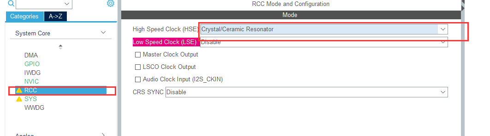
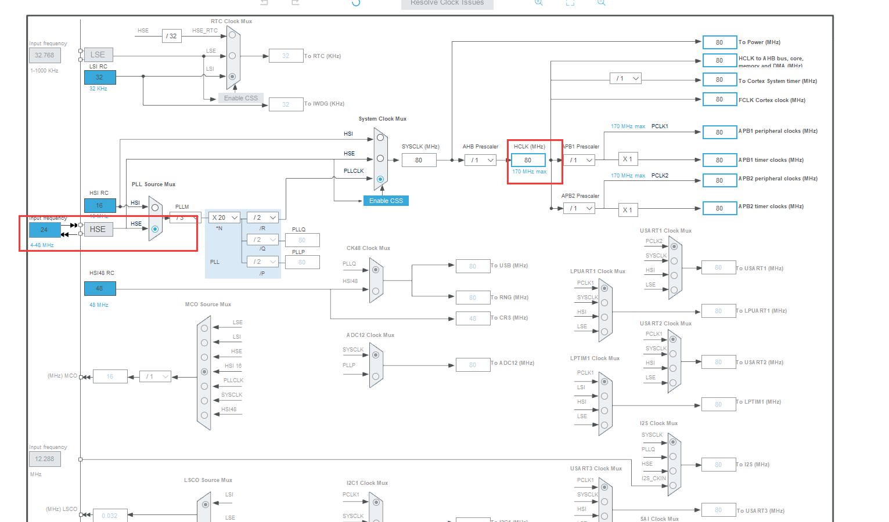
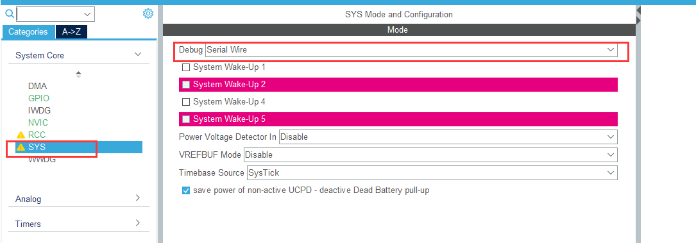

设置系统时钟速率







```c_cpp
void LCD_Init(void)

void LCD_WriteReg(u8 LCD_Reg, u16 LCD_RegValue)

void LCD_WriteRAM_Prepare(void)

void LCD_WriteRAM(u16 RGB_Code)
```

在上面几个函数开始添加如下代码

```c_cpp
uint16_t temp = GPIOC->ODR;
```

结尾添加

```
GPIOC->ODR = temp;
```
